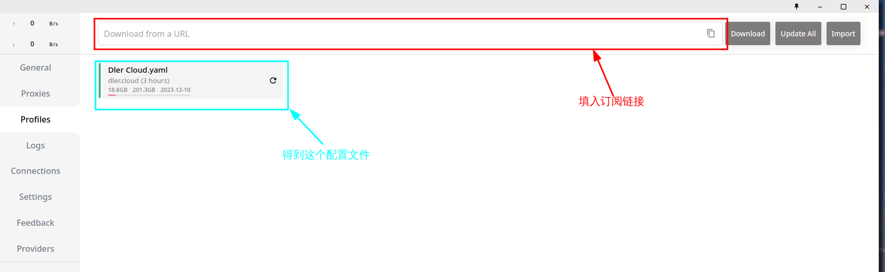
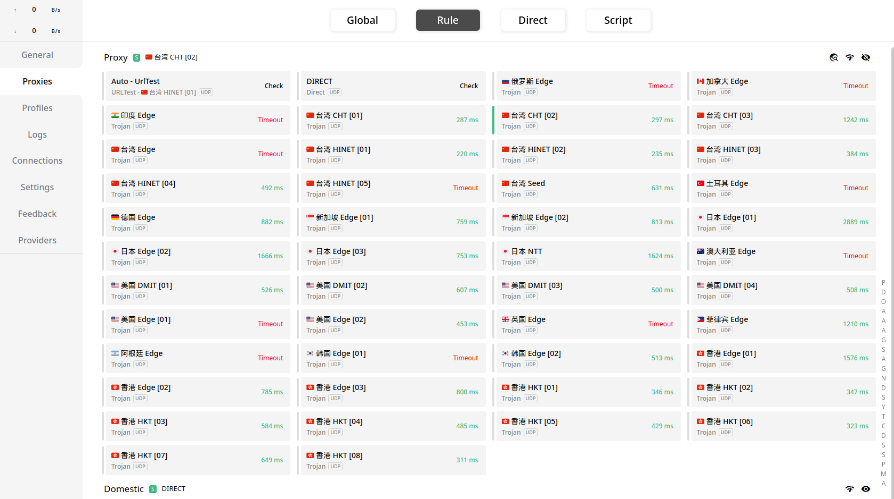
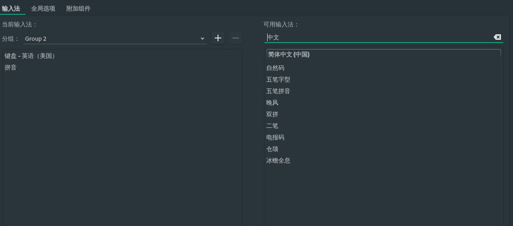
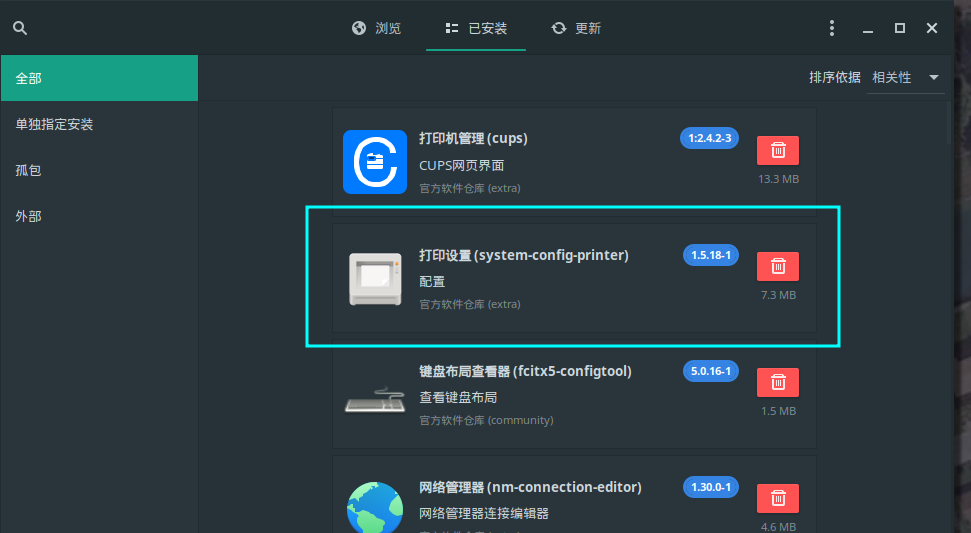
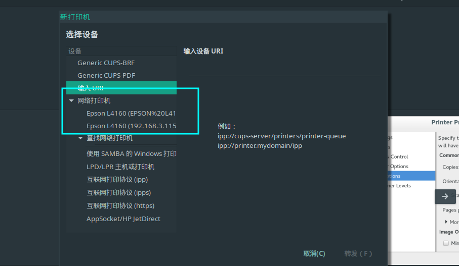
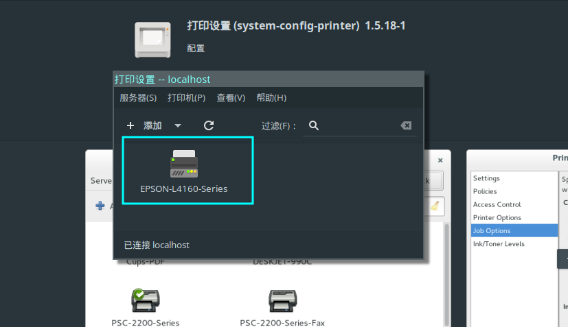
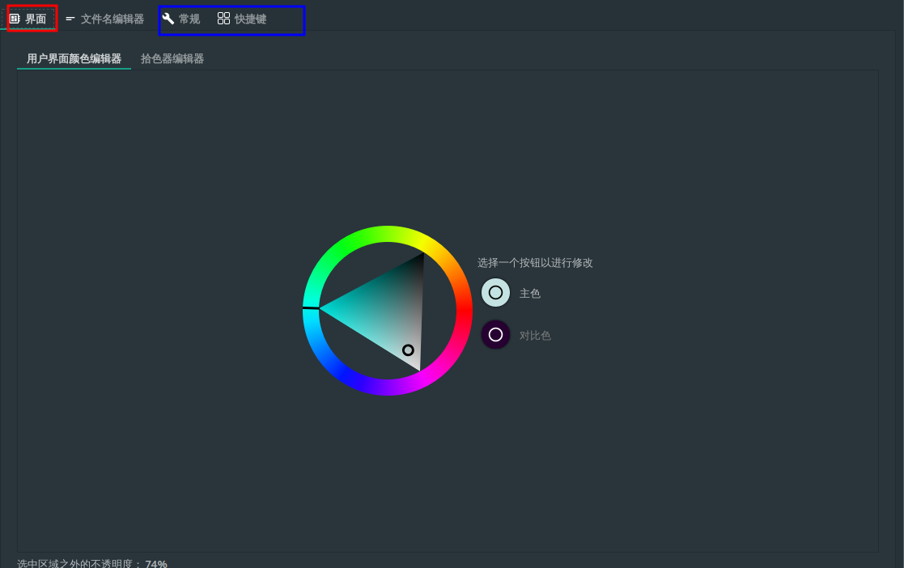

# Manjaro-I3-settings
 记录在使用Manjaro i3过程中所遇到的问题以及解决方法。

##1.科学上网
如果不会科学上网，请立刻大小使用Linux的想法，就像MACOS一样，没有科学上网Homebrew也非常难用，好在有水果公司维护一个强大的appstore,让一般用户也能很好的使用。但是Linux,尤其是Manjaro这种不想ubuntu这种有商业公司维护的Linux系统，没有科学上网，你就失去了开源社区的支持，Linux的使用也就毫无意义。

使用的是Clash-for-windows进行科学上网，首先在windows上一直在使用Clash，并且有购买订阅。


```bash
    yay -S clash-for-windows-bin 
    
```
这个是带图形界面的版本，基本和windows上一样，在选择proxy的时候更方便一些。配置的过程主要分为以下几步：

1. 填入订阅连接

填入订阅连接之后，会在～/.config/clash目录下生成对应的config文件以及Country文件，这个时候很大可能在proxies这个选项卡里面不会刷新出来对应的代理。

2. copy文件到～/.config/clash/profiles文件夹
需要将windows内的代理文件copy到clash的配置文件夹内的profiles文件夹内。

最终的结果：



##2.基础配置
I3作为一个平铺式的桌面管理软件，本质上和windows以及macos那些分屏工具是一样的，更多的是一些manjaro本身的一些配置，例如terminal的设置，字体设置、透明度设置等等，这些设置虽然复杂但是有了科学上网之后，基本都可以跟着视频教程完成。

我的配置列表：
    
    * alacritty作为终端，如果想要实现透明，需要安装picom进行实现
    * fish, 主要是跟着视频学的

i3安装之后，i3本身的配置文件地址是在 ～/.i3/config文件内，其他安装的软件都是在～/.config/<package-name>内进行的。

##3.输入法
中文输入法使用的是fcitx5,使用的默认的输入法，起码能用，能够解决绝大部分场景，可能没有联想功能。
这个比较简单，需要注意的是需要设置环境变量。
安装完成后，同样设置开机启动，并且添加输入法。


##4.快捷键
比较常用的快捷键有

    - 打开终端 $mod+Enter
    - 桌面切换 $mod+1 2 3 4 5 6 
    - 推出程序 $mod+Shift+Q 
    - 让一个应用floating $mod+Shift+Space
    - 可以调整一个窗口的大小 $mod+r 然后可以使用 h j k ;进行调整大小 
    - dmenu $mod+d
这些快捷键都可以在～/.i3/config里面进行设置。


##5.蓝牙
蓝牙是非常重要的一个事情，因为我目前用的主机是一个小型机器，SER6PRO,自带蓝牙和无线网模块，因此我想的是我的键盘和鼠标都可以自动无线连接。

```bash 
sudo pacman -S bluez bluez-utils pulseaudio-bluetooth pavucontrol pulseaudio-alsa pulseaudio-bluetooth-a2dp-gdm-fix
```
安装之后需要使用进行连接

```bash
bluetoothctl #进入蓝牙模型
scan on #扫描列表，得到蓝牙的MAC地址

pair **:**:** # 进行配对，配对成功
connect **:**:** # 连接
```

成功之后，本次连接成功，退出。但是连接也只能成功这一次，如果机器重启之后，不会自动连接，还需要重新connect一次。

对于一直连接的设备，例如蓝牙鼠标和蓝牙键盘，可以在开机启动时将连接代码写在config文件内：


```lua 
    exec bluetoothctl connect **:**:**:** --注意一定是配对过的设备

```
对于非一直连接设备例如蓝牙耳机，不知道是哪里没有设置好*-*，目前的解决方案是将connect命令alias为一个简单命令，例如我的耳机的命令是：


```bash 
    alias bca "bluetoothctl connect **:**:**:**:**" #bluetooth connect airset
    funcsave bca
    
    alias bcm "bluetoothctl connect **:**" #连接鼠标

```
如果没有连接，只需要打开终端输入bca就可以连接上了，同样连接鼠标也有类似的命令，以防止启动的时候没连接上，另外还是建议使用2.4G连接或者有限的键盘以防万一，这个命令需要设备同时也在请求连接的状态。


##6.打印机
manjaro本身自带了一个打印设备管理，使用网页进行配置的，但是对于同一个局域网的打印机我的找不到，使用了以下命令安装依赖
```bash
sudo pacman -S cups print-manager cups-pdf system-config-printer 


```
主要是使用的cups进行的打印机配置服务，然后可以使用system-config-printer进行UI设置，例如下图

使用system-config-printer进行配置，第一个不好用


然后可以添加网络打印机，注意需要选择正确的打印机，最好是打印测试以下，那一个正常选择哪一个。


添加成功以后在其他应用例如WPS中就可以找到进行打印。



##7.硬盘挂载
我使用的SER6PRO是有一个pice4.0的固态硬盘以及一个SATA3.0的固态硬盘，我的系统装载第一个硬盘里面，我需要挂载第二块硬盘。
1.首先对第二块硬盘分区
Linux下面有一个好用的磁盘管理软件就是GParted,这个也是i3自带的应用，具有图形界面。


特别简单的就可以进行分区的操作，我是将第二块磁盘建立了两个主分区，格式为ext4， 分别挂载到/public/data /public/video两个位置，主要用于数据存储。挂载的命令是：
```bash 

    sudo mount /dev/sda1 /public/data
    sudo mount /dev/sda2 /public/video

```

2.保存挂载点，并开机启动
这里的话就需要查到两块分区的UUID,需要使用以下命令
```bash 
    blkid | grep /dev/sda #这个就是硬盘的盘符
```

就会看到之前的两个硬盘的UUID
``` bash 
/dev/sda1: UUID="c06e3ewe-e0da-4df5-bd3a-8e68c6690222" BLOCK_SIZE="4096" TYPE="ext4" PARTUUID="ee432495-01"
/dev/sda2: UUID="4dd812f8-465d-478a-8b82-4d383e1c4dfa" BLOCK_SIZE="4096" TYPE="ext4" PARTUUID="ee432495-02"
```
这样就可以对 vim /etc/fstab 进行开机挂载。

``` bash 
# <file system>             <mount point>  <type>  <options>  <dump>  <pass>
UUID=67FC-B374                            /boot/efi      vfat    umask=0077 0 2
UUID=c06e3ewe-e0da-4df5-bd3a-8e68c6690222 /              ext4    defaults,noatime 0 1
tmpfs                                     /tmp           tmpfs   defaults,noatime,mode=1777 0 0
UUID=c06e3ewe-e0da-4df5-bd3a-8e68c6690222 /public/data   ext4    defaults,noatime 0 2 
UUID=4dd81af8-464d-471a-8b92-4d383e1c4dfa /public/video  ext4    defaults,noatime 0 2
```
注意上面的UUID是没有引号的，分别是挂载点， 文件系统类型，DUMP不需要管，PASS是硬盘自检顺序，自己硬盘的/的顺序第二个数字一定要是1,只接受0,1,2,其他盘都设置为2就可以了。

这样就可以了，重启之后硬盘也在。

3. 顺便U盘的挂载
首先U盘的格式需要是FAT32,也就是WINDOWs下面的格式,查看U盘位置可以有两种方法，一种就是上面的Gparted工具，另外一种就是使用命令行：
```bash 
    sudo fdisk -l 
```
找到U盘的盘符，例如/dev/sdb1
这时候需要挂载U盘，i3下会有一个默认文件夹叫做 /mnt/usb
把U盘进行挂载
```bash 
    sudo mount /dev/sdb1 /mnt/usb
```
挂载成功之后就可以进行文件操作了。

##8.中文字体


##9.deb安装


##10.坚果云和百度云


##11.截图工具Flameshot
截图软件使用Flameshot，这个截图软件十分好用，基本和微信的截图功能一样的，完全可以替代。直接通过pacman进行安装：

```sh
    sudo pacman -S flameshot

```
安装之后可以设置开机启动以及绑定截图快捷键,在～/.i3/config文件中加入以下代码：

```sh
    exec flameshot -b # 这个就是开机启动 background运行
    bindsym $mod+Shift+A exec flameshot gui #使用快捷键进行截图

```
ok,剩下的可以自由使用了，同样可以设置快捷键进行。



##11.WPS

##12.LunarVim

##13.Python

##14.Vulkan

##15.cmake

##16.微信和腾讯会议

##17.音乐软件


